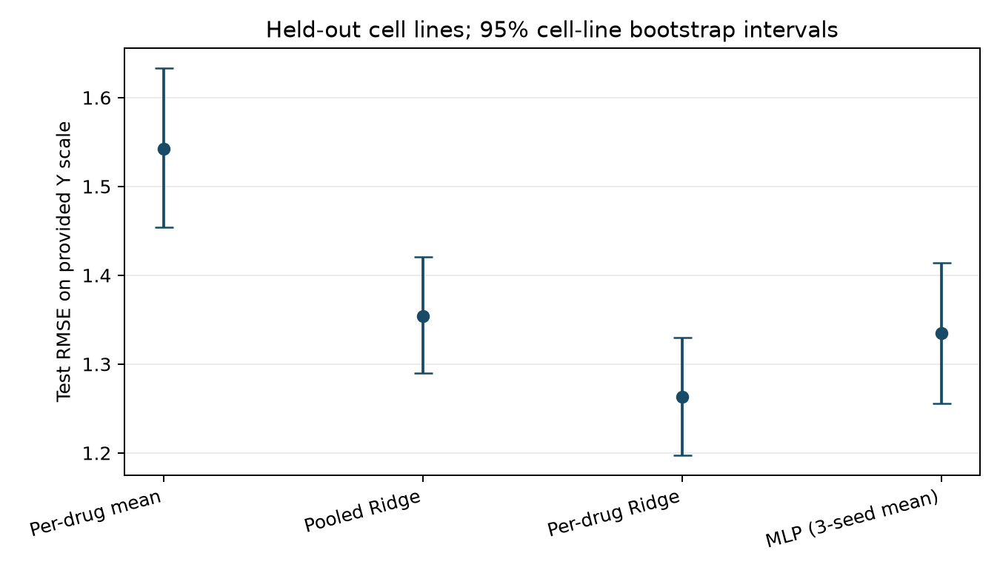

# Cancer drug-response prediction for unseen cell lines

## Research question

How accurately can gene expression and molecular features predict drug response in **previously unseen cancer cell lines**, for **drugs represented in training**? This is an experimental cell-line study. Its results do not establish patient treatment effectiveness or generalization to unseen drugs.

## Data and evaluation

The study uses the [TDC GDSC2 DrugRes dataset](https://tdcommons.ai/multi_pred_tasks/drugres/): gene-expression vectors for cell lines, drug SMILES, and the dataset-provided response `Y`. The raw TDC snapshot has 92,703 rows. The primary analysis excludes all 1,474 Uprosertib rows because conflicting drug–cell responses cannot be matched to distinct upstream compound or experiment IDs. It analyzes **91,229 response rows, 805 cell lines, and 136 drugs**. The separate [sensitivity analysis](results/final_evaluation.md#uprosertib-sensitivity) evaluates an explicitly assumed arithmetic mean for Uprosertib pairs.

One seed-17 assignment splits unique cell-line identities into **564 training, 121 validation, and 120 test cell lines** (approximately 70/15/15). Every response from one cell line stays in one partition; every evaluated drug appears in training. The split was fixed before fitting, and validation selected hyperparameters and MLP checkpoints. No model was refit on training plus validation. The test set contains 13,622 non-Uprosertib responses from 120 held-out cell lines. BI-2536 has no test observations under this fixed split.

Expression is stored once per cell line and represented by 128 PCA scores, then standardized; variance filtering, scaling, PCA, and score scaling were fitted on **unique training cell lines only**. A 2,048-bit radius-2 Morgan fingerprint is stored once per drug. The target remains on the provided `Y` scale, without another logarithm. See the [data audit](results/data_audit.md) and [preprocessing report](results/preprocessing_report.md) for schema, checks, hashes, and handling choices.

## Held-out results

All rows in this table refer to the **same primary test pairs**. RMSE and MAE weight each response equally. The MLP entry averages three separately trained seed-specific **metrics**, not their predictions.

| Model | Test RMSE | Test MAE |
| --- | ---: | ---: |
| Per-drug training mean | 1.5427 | 1.1785 |
| Pooled Ridge | 1.3539 | 1.0186 |
| **Per-drug Ridge** | **1.2628** | **0.9536** |
| MLP, three-seed metric mean ± sample SD | 1.3347 ± 0.0046 | 1.0056 ± 0.0080 |

Validation-selected **per-drug Ridge reduced test RMSE by 18.1% versus the per-drug training-mean baseline**: `(1.542654 - 1.262829) / 1.542654`. The fixed 256→128 PyTorch MLP improved on the mean baseline but did **not** improve on per-drug Ridge. Pooled Ridge adds a common expression effect and drug fingerprint effect; separate per-drug Ridge fits allow drug-specific expression coefficients. [Full test metrics](results/final_test_comparison.csv), [drug-level results](results/final_test_by_drug.csv), and the [final report](results/final_evaluation.md) include equal-drug RMSE, within-drug Spearman with undefined cases, sample counts, and limitations.



The figure shows uncertainty from **2,000 paired whole-cell-line bootstrap draws**, conditional on the fitted models and this split. It does not measure variation from retraining or new drugs. The [paired intervals](results/final_bootstrap_intervals.csv), [drug-level error figure](results/figures/drug_level_errors.png), and [MLP learning curves](results/figures/mlp_learning_curves.png) provide complementary views.

## Exploratory robustness and PCA sensitivity

A [prespecified follow-up](configs/robustness_pca.json) repeated the fixed known-drug comparison on **five additional cell-line-disjoint splits** (seeds 19/23/29/31/37), refitting training-only preprocessing and selecting model settings by validation within each split. These are overlapping views of the **same** GDSC2 snapshot, not independent validation. Per-drug Ridge had the lowest test RMSE in all five: median **1.2502** (range 1.1918–1.2614), versus 1.4911 for the per-drug mean, 1.3458 for pooled Ridge, and 1.3058 for the MLP's three-seed metric mean. Its median paired RMSE advantage over the MLP was 0.0828 on the provided `Y` scale. [Full report and reproduction commands](results/robustness_pca.md), [comparison table](results/robustness_multisplit_comparison.csv), and [paired uncertainty figure](results/figures/multisplit_paired_rmse.png) preserve split-specific counts and conditional cell-line bootstrap intervals.

Using the same splits, separately fitted 64/128/256-component PCA pipelines retained median training-expression variance of 53.0%/65.2%/80.1%. A 256-component per-drug Ridge fit improved test RMSE over 128 components in four of five splits, with a median paired change of **−0.0094**; only one split's conditional interval excluded zero. These are exploratory pipeline-sensitivity results, not a new selected final model. See the [PCA figure](results/figures/pca_dimension_sensitivity.png) and [detailed results](results/robustness_pca.md#pca-pipeline-sensitivity). An [external-data feasibility audit](results/external_data_feasibility.md) documents why no cross-assay RMSE is reported yet: identifiers, expression representation, and response scale require mapping first.

## Exploratory molecular GNN extension

An optional follow-up replaced the fixed Morgan fingerprint with an RDKit molecular graph encoder (two PyTorch Geometric GINE layers and global mean pooling), while retaining the same standardized expression PCA, primary data, and frozen cell-line assignment. Three fixed training seeds were run without a new architecture or learning-rate search. The GNN's three-seed **metric-mean** validation RMSE was **1.6556 ± 0.0354** sample SD, versus **1.2367** for per-drug Ridge; its exploratory test RMSE was **1.6641 ± 0.0435**, versus **1.2628** for unchanged per-drug Ridge on identical pairs. Thus this specific graph model did not improve the study's prediction accuracy. The original test results were already public before the GNN architecture was chosen, so this test comparison is exploratory rather than a fresh confirmatory evaluation. See the [GNN validation report](results/gnn_validation.md), [GNN final comparison](results/gnn_final.md), and [extension figure](results/figures/gnn_extension.png) for per-seed results, drug-level metrics, paired cell-line bootstrap intervals, checks, and limitations.

## Data access and terms

No raw or processed dataset, row-level prediction, or fitted checkpoint is distributed here. `src/retrieve_gdsc2.py` downloads the two **TDC-identified Harvard Dataverse files** and verifies their MD5 hashes. The [data retrieval notes](data/README.md) and [audit](results/data_audit.md#environment-and-retrieval) record the file IDs, source URLs, retrieval date, SHA-256 hashes, and PyTDC loader compatibility issue. These files identify the TDC snapshot but do not resolve its exact upstream GDSC release or row-level mapping.

TDC lists [CC BY-NC-ND 2.5 for GDSC2](https://tdcommons.ai/multi_pred_tasks/drugres/); the upstream [Sanger data-use policy](https://depmap.sanger.ac.uk/documentation/data-usage-policy/) also applies. Retrieve the data from the source and review those terms for your use. This repository does **not** assert permission to redistribute the dataset or derived row-level records.

## Reproduction and checks

Run from the repository root with **Python 3.12**. Create `.venv` using your preferred Python manager; the commands below use the Windows virtual-environment executable and relative paths. The tested NVIDIA setup is captured in [configs/environment-final.txt](configs/environment-final.txt) and its [full lock](configs/environment-final-lock.txt). That recipe pins a CUDA-enabled PyTorch wheel; for a CPU or other accelerator setup, select the matching wheel from the [official PyTorch installation guide](https://pytorch.org/get-started/locally/) while keeping the other pinned dependencies. The research scripts also support CPU execution.

```powershell
& ".venv\Scripts\python.exe" --version
& ".venv\Scripts\python.exe" -m pip install -r "configs\environment-final.txt"
& ".venv\Scripts\python.exe" "src\retrieve_gdsc2.py"
& ".venv\Scripts\python.exe" "src\audit_gdsc2.py"
& ".venv\Scripts\python.exe" "src\prepare_gdsc2.py"
& ".venv\Scripts\python.exe" "src\check_preprocessing.py"
& ".venv\Scripts\python.exe" -m unittest discover -s "tests" -v
& ".venv\Scripts\python.exe" -m pip check
```

The version check should report Python 3.12. On macOS/Linux, replace the executable with `.venv/bin/python` and use equivalent shell syntax. Model scripts are [`run_baselines.py`](src/run_baselines.py), [`run_neural.py`](src/run_neural.py) (`--smoke-only` is available), [`run_sensitivity.py`](src/run_sensitivity.py), and [`evaluate_final.py`](src/evaluate_final.py), with matching `check_*.py` replay checks in `src/`. The [baseline](results/baseline_validation.md), [MLP](results/neural_validation.md), and [final](results/final_evaluation.md#reproduction-and-verification) reports state their order and settings.

The optional GNN requires the additional [PyTorch Geometric environment recipe](configs/environment-gnn.txt). Its [separate report](results/gnn_final.md#reproduction-and-limits) documents execution order and the extension's frozen-run boundary. It is not required to reproduce the original Ridge/MLP study.

**Reproduction boundary:** `configs/final_evaluation.json` is a locked record of the original run and checks exact input, manifest, and checkpoint hashes. A newly trained MLP or regenerated manifest may have different bytes, so the final sensitivity/evaluation scripts can intentionally reject a fresh run even when its method is the same. The published aggregate results document the original locked evaluation; exact replay requires its locally retained, Git-ignored artifacts. Do not treat the frozen lock as a portable promise of byte-identical GPU retraining.

### Independent fresh run

[`src/run_fresh.py`](src/run_fresh.py) runs the **primary** preparation, baseline validation, optional fixed six-run MLP validation, and held-out evaluation in a *new* directory. It checks the input SHA-256 values before loading the TDC pickle, copies the fixed configurations, and writes a **run-specific evaluation lock after validation and before test scoring**. It does not read or alter the published checkpoints or results. First retrieve the TDC-identified inputs as described in [data/README.md](data/README.md). With the complete environment above, run from the repository root:

```powershell
& ".venv\Scripts\python.exe" "src\run_fresh.py" --input-dir "data\raw" --run-dir "data\fresh_runs\primary-01" --models primary
```

Choose a directory name that does not exist yet; each run gets its own ignored tables, models, predictions, lock, and `results/fresh_test_comparison.csv`. The default uses 2,000 paired cell-line bootstrap draws. `--models baselines` runs only the per-drug mean and the two Ridge models, and does not require PyTorch. The [synthetic CPU CI workflow](.github/workflows/synthetic-cpu.yml) exercises this baseline route on invented data, including the split, train-only transforms, validation selection, test evaluation, and saved-prediction replay. Its scores are pipeline diagnostics, not GDSC2 findings. The full MLP route is tested locally and requires PyTorch; select the wheel appropriate to your machine using the [official installation guidance](https://pytorch.org/get-started/locally/).

The fresh runner covers the original **primary** known-drug question. It deliberately does not rerun the historical Uprosertib sensitivity experiment or the later GNN extension. Its test results are a methodological check on a known, previously published study; the original test outcomes are already public, so a fresh run on the same snapshot is not independent scientific confirmation. Report any new run separately from the [original locked results](results/final_evaluation.md).

The five-split follow-up uses the fresh runner through [`run_multisplit.py`](src/run_multisplit.py), then [`run_pca_sensitivity.py`](src/run_pca_sensitivity.py). The [robustness report](results/robustness_pca.md#reproduce-and-verify) gives exact commands and the limits of inference. Both runners require new Git-ignored output directories under `data/` and preserve the original frozen artifacts.

## Limitations

The original locked study uses one cell-line split; the five additional, overlapping splits are exploratory internal robustness checks. All analyses cover only drugs seen during training. The response is the provided `Y` scale: TDC calls it log-normalized IC50, and Sanger describes upstream `LN_IC50` as a natural logarithm, but the exact snapshot-to-source mapping and concentration reference remain unresolved. The original 128-component PCA retains **65.303%** of standardized training-expression variance, so discarded dimensions could contain predictive signal. Uprosertib's conflicting entries lack source identifiers; excluding them defines the primary analysis, while averaging them in the sensitivity table is an analytical assumption. These cell-line results are not clinical predictions.

## Repository contents

| Path | Contents |
| --- | --- |
| [`src/`](src/) | Retrieval, audit, preparation, modeling, evaluation, and replay code |
| [`tests/`](tests/) | Focused alignment, split, preprocessing, metric, and inference checks |
| [`configs/`](configs/) | Fixed configurations and environment specifications |
| [`results/`](results/) | Compact reports, aggregate tables, manifests, and figures |
| [`data/README.md`](data/README.md) | Retrieval and provenance guidance; data files are excluded |

Downloaded data, generated arrays, frozen splits, checkpoints, row-level predictions, and local application materials are intentionally outside the public files.
