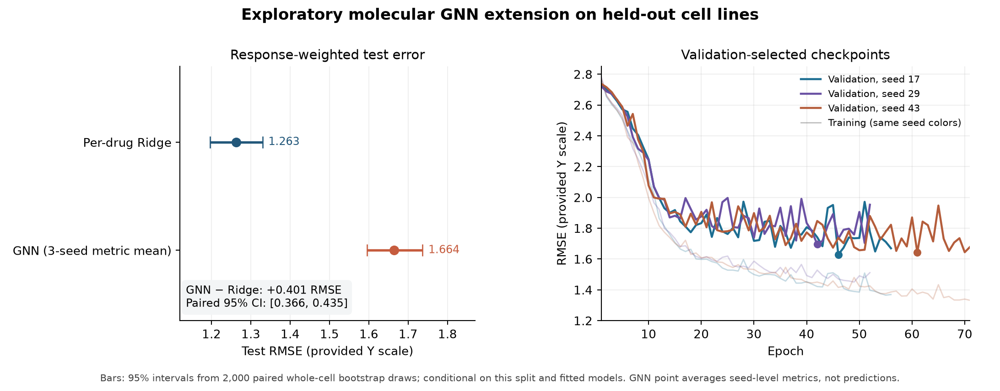

# Exploratory molecular GNN: held-out comparison

Completed 2026-09-23. The [GNN validation report](gnn_validation.md) describes the one fixed graph architecture and its three retained best-validation checkpoints. Their identities, the frozen primary data and preprocessing, original baseline prediction file, same-cell-line split, and evaluation procedure were recorded in the [extension evaluation lock](../configs/gnn_final_evaluation.json) before computing **GNN** test predictions. **The original study's test results were already public before this GNN architecture was selected.** This extension test comparison is therefore **exploratory**, not a new independent confirmatory test. No model was retrained, retuned, selected by test outcome, or refit on training plus validation.

## Same-pair test results

All results use the same **13,622 non-Uprosertib responses** from **120 held-out cell lines**; 135 drugs have test observations. BI-2536 has none under the frozen assignment. RMSE and MAE give each response one vote. Equal-drug mean RMSE averages the 135 drug RMSEs. Within-drug Spearman requires at least three rows, nonconstant target, and nonconstant prediction; 124 drugs are eligible and defined for Ridge and every GNN run. Eleven drugs have too few test rows. The [full table](gnn_test_comparison.csv) and [drug-level table](gnn_test_by_drug.csv) retain exact metrics and counts.

| Model | Test RMSE | Test MAE | Equal-drug mean RMSE | Median within-drug Spearman |
| --- | ---: | ---: | ---: | ---: |
| **Original per-drug Ridge** | **1.2628** | **0.9536** | **1.2345** | **0.5626** |
| GNN, seed 17 | 1.6467 | 1.2679 | 1.6070 | 0.5093 |
| GNN, seed 29 | 1.7136 | 1.3279 | 1.6763 | 0.5042 |
| GNN, seed 43 | 1.6320 | 1.2763 | 1.6215 | 0.4955 |
| **GNN, mean ± sample SD of three seed-specific metrics** | **1.6641 ± 0.0435** | **1.2907 ± 0.0325** | **1.6349 ± 0.0365** | **0.5030 ± 0.0070** |

The GNN summary averages **metrics**, never predictions; it is not an ensemble. All three GNN seeds have greater error than the unchanged per-drug Ridge on the same pairs. The GNN mean test RMSE also exceeds the original [per-drug mean baseline's 1.5427](final_evaluation.md#primary-test-results) and the MLP three-seed metric mean of 1.3347. The result indicates that this particular graph encoder and training setup did not add predictive value on this split. It does not rule out other graph featurizations, pooling methods, architectures, or training procedures; none was tested here.



The figure pairs the response-weighted test comparison and its conditional 95% cell-line bootstrap intervals with the three [training and validation curves](gnn_learning_curves.csv). The marked checkpoints are the best validation epochs; the three-seed test point is the mean of seed-specific metrics. It can be regenerated from the tracked aggregate tables with `python src/plot_gnn.py`.

## Paired cell-line uncertainty

The extension reused the original **2,000 paired, whole-cell-line bootstrap draws** (seed 2026). Each draw resamples the 120 held-out cell lines with replacement, including **all** responses and repeated-cluster multiplicities, and is applied to both models. The GNN three-seed summary re-averages three separate seed-specific metrics inside each draw; predictions are never averaged. Intervals are percentile 95% intervals. The paired difference is `GNN RMSE − per-drug Ridge RMSE`, so a positive interval favors Ridge. See the [exact interval table](gnn_bootstrap_intervals.csv).

| Model | RMSE 95% interval | MAE 95% interval | Paired RMSE difference 95% interval |
| --- | ---: | ---: | ---: |
| Per-drug Ridge | [1.1969, 1.3297] | [0.9045, 1.0046] | 0 by definition |
| GNN seed 17 | [1.5805, 1.7137] | [1.2145, 1.3243] | [0.3502, 0.4173] |
| GNN seed 29 | [1.6464, 1.7831] | [1.2729, 1.3855] | [0.4142, 0.4845] |
| GNN seed 43 | [1.5535, 1.7128] | [1.2118, 1.3435] | [0.3252, 0.4092] |
| **GNN three-seed metric mean** | **[1.5954, 1.7364]** | **[1.2350, 1.3507]** | **[0.3658, 0.4352]** |

These intervals describe variation from sampling cell lines **conditional on the fitted models and this specific split**. They differ from the sample SD across training seeds and do not cover model retraining, a new split, unseen drugs, or clinical outcomes.

## Reproduction and limits

Install the [GNN environment recipe](../configs/environment-gnn.txt) in a dedicated Python 3.12 environment. The [installed package lock](../configs/environment-gnn-lock.txt), [validation manifest](gnn_validation_manifest.json), [extension lock](../configs/gnn_final_evaluation.json), and [final manifest](gnn_final_manifest.json) record versions and identities. After retrieving and preparing the data as described in the root README, a **fresh validation run** can execute from the repository root:

```powershell
& ".venv\Scripts\python.exe" "src\run_gnn.py" --smoke-only
& ".venv\Scripts\python.exe" "src\run_gnn.py"
& ".venv\Scripts\python.exe" "src\check_gnn.py"
```

**Exact frozen test replay** requires the original local, Git-ignored data, baseline test predictions, 2,000 bootstrap draws, and all three GNN checkpoints with hashes matching the extension lock. In that original workspace, run:

```powershell
& ".venv\Scripts\python.exe" "src\evaluate_gnn.py"
& ".venv\Scripts\python.exe" "src\check_gnn_final.py"
```

The [independent final replay](gnn_final_replay_check.json) verified all three checkpoint identities, row alignment for all 13,622 test responses, metric calculations, and the same 2,000 paired cell-line draws. Checkpoint reloaded predictions agreed within the documented `1e-5` float32 tolerance. The lock contains SHA-256 hashes of original ignored artifacts and trained GNN checkpoints. A fresh training run can differ at the byte level, particularly on GPU, and will intentionally fail exact-hash replay; the tracked aggregate tables document the completed locked run. Row-level predictions, checkpoints, and per-draw arrays stay Git-ignored. The study remains restricted to known drugs in experimental cell lines, supplied `Y`, one cell-line split, 128-component expression PCA (65.303% variance retained), and the primary exclusion of conflicted Uprosertib measurements. The exact upstream TDC-to-Sanger snapshot mapping remains unresolved. No result here estimates patient treatment effectiveness.
