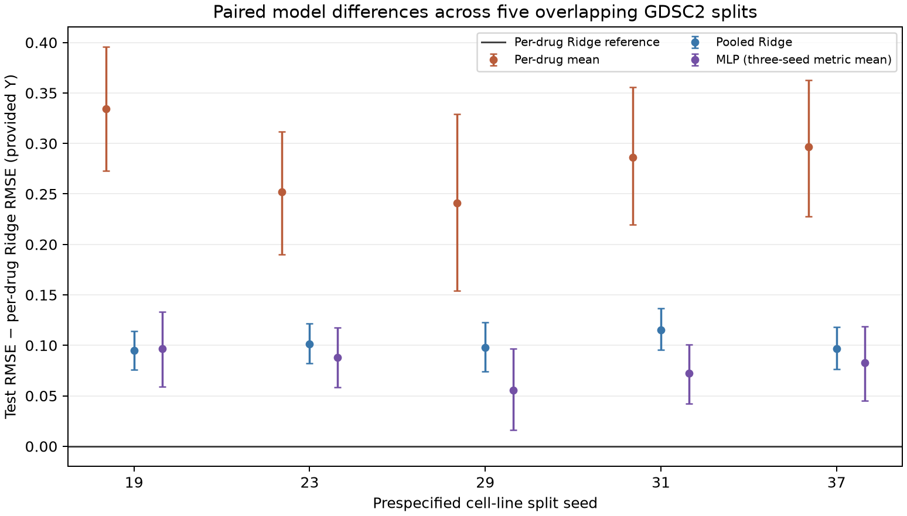
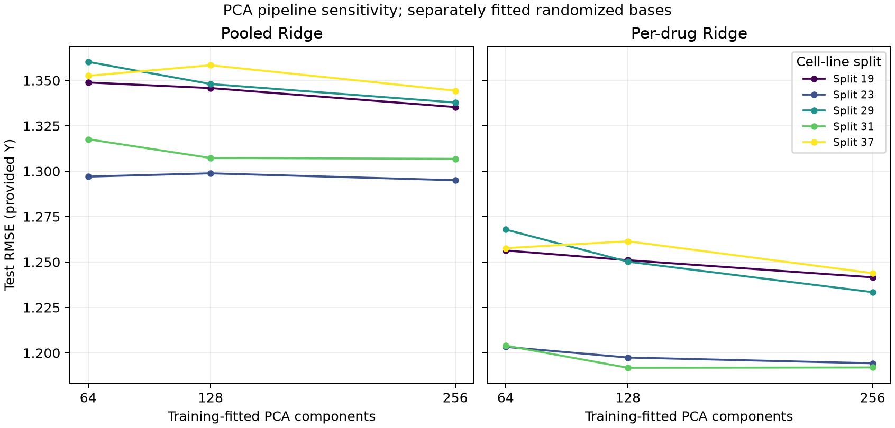

# Exploratory grouped-split and PCA sensitivity study

**Status:** Completed 24 September 2026 (US Central time). This follow-up uses the same public TDC GDSC2 snapshot and the same primary non-Uprosertib response table as the [original locked study](final_evaluation.md). Its overlapping cell-line splits measure **internal robustness**, not independent confirmation or patient outcomes. The original seed-17 result remains unchanged and is a historical reference, not a sixth draw in the summaries below.

## Protocol and execution

The [protocol](../configs/robustness_pca.json) was committed before any new fitting (`d96bad0`, clarified by `3adb66a` before execution). The five additional split seeds are the first five primes after 17: **19, 23, 29, 31, 37**. Each sorts unique cell-line IDs, permutes IDs with its fixed seed, and assigns 564/121/120 lines to training/validation/test. All 91,229 primary responses (805 lines, 136 drugs) retain their source-row identity and provided `Y`; no Uprosertib response is restored. Every evaluated drug is represented in training for every split. Test response counts are 13,476 / 13,909 / 13,581 / 13,709 / 13,415. All 136 drugs have test rows in these five splits; this does not alter BI-2536's missing test coverage in the original seed-17 split.

Each split independently fits the saved preparation recipe on **unique training cell lines**: variance filter, gene scaler, randomized 128-component PCA, and PCA-score scaler. It keeps the same binary radius-2, 2,048-bit Morgan fingerprints. Training responses fit the per-drug mean, pooled Ridge, per-drug Ridge, and the fixed 256→128 MLP. Ridge alpha uses the original seven-value grid, selected on validation RMSE; the MLP compares the original two rates across training seeds 17/29/43, selecting a rate by mean three-seed validation RMSE. No training-plus-validation refit, seed cherry-picking, new architecture, or response transformation was added. Each run saved its validation choices and artifact hashes before its test evaluation. Per-drug Ridge was validation-selected in all five splits; the selected MLP rate was 3e-4 in all five. Pooled Ridge alphas were 100/100/100/10/10 and per-drug Ridge alphas 100/100/10/100/100 in seed order.

The PCA sensitivity arm uses these **same five assignments and response pairs**. For 64 and 256 components, it reuses each split's training-fitted gene filter/scaler, then fits a new seeded randomized PCA and score scaler on unique training cells. The 128-component arm reuses that split's saved model. Pooled and per-drug Ridge each select one alpha per dimension and split using validation only. All fitted objects and selections were hashed in a [pretest lock](robustness_pca_pretest_lock.json) before this arm scored 64/256-component test predictions. The earlier five-split 128-component test results already existed, so all PCA test comparisons are explicitly exploratory. The three PCA bases are **separately fitted randomized approximations**; observed differences combine dimensionality and basis approximation, rather than isolating only discarded information.

## Grouped-split results

Each model row below summarizes five **response-weighted test metrics**, one per split. Ranges are observed minimum–maximum across the five overlapping assignments, not confidence intervals. The MLP row averages three seed-specific **metrics within each split**, without ensembling predictions.

| Model | Test RMSE median (range) | Test MAE median | Equal-drug mean RMSE median | Median defined within-drug Spearman, across splits |
| --- | ---: | ---: | ---: | ---: |
| Per-drug training mean | 1.4911 (1.4496–1.5856) | 1.1248 | 1.4090 | undefined: constant predictions |
| Pooled Ridge | 1.3458 (1.2989–1.3584) | 1.0050 | 1.2826 | 0.5232 |
| **Per-drug Ridge** | **1.2502 (1.1918–1.2614)** | **0.9403** | **1.1925** | **0.5654** |
| MLP, three-seed metric mean | 1.3058 (1.2639–1.3477) | 0.9809 | 1.2906 | 0.5360 |

Per-drug Ridge had the lowest test RMSE in **all five** assignments. Relative to it, median **paired within-split** RMSE differences were +0.2861 for the per-drug mean, +0.0978 for pooled Ridge, and +0.0828 for the MLP metric mean. The per-split 95% paired whole-cell-line bootstrap intervals for each of those differences excluded zero in all five runs. These are conditional intervals for each fitted split, from 2,000 paired cluster resamples (seed 2026, same draws across models); five overlapping splits do not provide five independent replications or a population-level confidence interval. Training-seed variation for each MLP is reported separately in the [comparison table](robustness_multisplit_comparison.csv).

Within-drug Spearman requires at least three test rows and nonconstant target and prediction vectors. Four splits had 136 eligible and defined drug correlations for Ridge and MLP. Seed 23 had **131 eligible/defined** drugs; five had insufficient test rows. The per-drug mean has zero defined correlations because each drug's predictions are constant. The [drug-level table](robustness_multisplit_test_by_drug.csv) preserves counts, errors, correlation status, and each MLP seed. The MLP metric mean has no synthetic per-drug prediction vector.



## PCA pipeline sensitivity

The median fraction of **training-standardized expression variance** retained by the separately fitted PCA arms was 53.0% / 65.2% / 80.1% for 64 / 128 / 256 components. The table reports response-weighted test RMSE across the same five assignments. Paired differences below compare each dimension to **its own split's 128-component fit**.

| Model | Components | Test RMSE median (range) | Median paired ΔRMSE vs 128 | Splits with lower RMSE than 128 |
| --- | ---: | ---: | ---: | ---: |
| Per-drug Ridge | 64 | 1.2564 (1.2033–1.2679) | +0.00588 | 1/5 |
| Per-drug Ridge | 128 | 1.2502 (1.1918–1.2614) | reference | — |
| Per-drug Ridge | 256 | 1.2335 (1.1920–1.2439) | −0.00941 | 4/5 |
| Pooled Ridge | 64 | 1.3488 (1.2970–1.3602) | +0.00307 | 2/5 |
| Pooled Ridge | 128 | 1.3458 (1.2989–1.3584) | reference | — |
| Pooled Ridge | 256 | 1.3353 (1.2950–1.3444) | −0.01020 | 5/5 |

The 256-component per-drug fit improved RMSE on four splits, but only **one** of its five conditional paired bootstrap intervals excluded zero. The pooled fit improved on all five, with **none** of its five intervals excluding zero. This suggests some sensitivity to the original PCA compression, without establishing a reliably superior new default. The [paired differences](robustness_pca_paired_differences.csv), [conditional intervals](robustness_pca_bootstrap_intervals.csv), [validation metrics](robustness_pca_validation_metrics.csv), and [drug-level results](robustness_pca_test_by_drug.csv) show all arms rather than selecting a test winner. The original 128-component models and public conclusions remain unchanged.



## External dataset gate

The [external-data feasibility audit](external_data_feasibility.md) identifies archival PRISM secondary screening as a candidate for a **metadata-first** transfer check. It does **not** score an external dataset. A direct external RMSE would require an unambiguous cell and drug crosswalk, a defensible conversion to the frozen expression feature order/scale, and verified numerical equivalence of the response endpoint to TDC's provided `Y`. PRISM's AUC or fitted `log2.ic50` cannot simply be substituted for this study's target. File-level inventory, terms, and overlap counts remain to be established before an external performance experiment.

## Reproduce and verify

Use the dataset retrieval steps in [data/README.md](../data/README.md) and the [tested environment](../configs/environment-final.txt). From the repository root, choose **new**, Git-ignored directories under `data/` for the workspaces:

```powershell
& ".venv\Scripts\python.exe" "src\run_multisplit.py" --input-dir "data\raw" --study-dir "data\robustness_runs\prime5-01"
& ".venv\Scripts\python.exe" "src\run_pca_sensitivity.py" --study-dir "data\robustness_runs\prime5-01" --output-dir "data\pca_runs\prime5-01"
& ".venv\Scripts\python.exe" "src\export_robustness_results.py" --study-dir "data\robustness_runs\prime5-01" --pca-dir "data\pca_runs\prime5-01"
& ".venv\Scripts\python.exe" "src\plot_robustness_pca.py" --split-csv "results\robustness_multisplit_comparison.csv" --pca-csv "results\robustness_pca_test_metrics.csv" --output-dir "results\figures"
```

The first command runs six fixed MLP validation fits per split and took about **12 minutes** across the five splits on the tested RTX 4070. The PCA validation and scoring run took under two minutes. CPU execution is supported but slower. A fresh GPU run need not be byte-identical; generated workspaces, row-level predictions, and fitted objects stay Git-ignored. Exported aggregate tables and provenance checksums are recorded in the [release manifest](robustness_release_manifest.json), with the [split manifest](robustness_multisplit_manifest.json) and [PCA manifest](robustness_pca_manifest.json). Focused tests cover the split rule, response identity, train-only fitting, Ridge equivalence, cluster bootstrap multiplicity, and saved-prediction replay; synthetic CI scores are diagnostics only.

## Limits and next question

These results reuse one GDSC2 snapshot and strongly overlapping cell-line groups; cross-split ranges are descriptive. The research question remains **known drugs on unseen experimental cell lines**. TDC's provided `Y` is unchanged; its exact upstream snapshot mapping and concentration reference remain unresolved. Uprosertib stays excluded for the primary analysis because conflicting responses lack resolvable source experiment/compound IDs; its historical mean-aggregation sensitivity remains an assumption. PCA may discard predictive signal, and its separate randomized fits complicate causal attribution of component-count effects. No result demonstrates patient treatment effectiveness, calibration to another assay, or transfer to unseen drugs. The next defensible external step is the metadata/identifier/scale audit described above, before any cross-assay performance claim.
